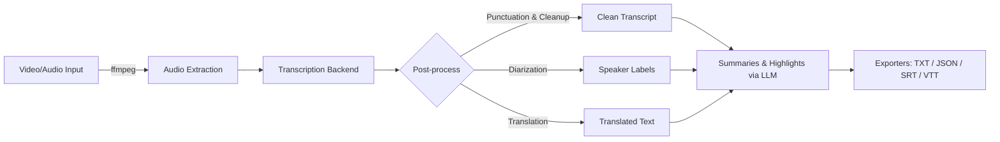

# 🎥 Video-to-Transcript-Generator

A simple and efficient tool that converts **video or audio files into clean, structured transcripts** with features like **summarization, translation, and speaker diarization**. Perfect for creators, students, professionals, and developers who need accurate transcripts from media files.

---

## 🚀 Features

- 🎙️ **Audio Extraction** from video files using `ffmpeg`
- 📝 **Transcription** of speech to text
- 🔍 **Speaker Diarization** (detects multiple speakers)
- 🌍 **Translation** into multiple languages
- ✨ **Summarization** powered by Large Language Models (LLMs)
- 📂 **Multiple Export Formats**: TXT, JSON, SRT, VTT
- 🔧 Easy integration into other projects

---

## 🏗️ Architecture



---

## ⚙️ Installation

```bash
# Clone the repo
git clone https://github.com/nitin-pandita/Video-to-Transcript-Generator.git
cd Video-to-Transcript-Generator

# Create virtual environment
python -m venv venv
source venv/bin/activate  # For Windows: venv\Scripts\activate

# Install dependencies
pip install -r requirements.txt
```

---

## ▶️ Usage

```bash
python main.py --input path/to/video.mp4 --output transcript.txt
```

Arguments:
| Argument            | Description                                   |
|--------------------|-----------------------------------------------|
| `--input`          | Path to video or audio file                   |
| `--output`         | Path to save transcript output                |
| `--language`       | Language code for transcription               |
| `--translate`      | Translate transcript (optional)               |
| `--summarize`      | Summarize transcript (optional)               |

---

## 📂 Project Structure

```
Video-to-Transcript-Generator/
│
├── main.py                 # Entry point for running the tool
├── requirements.txt        # Python dependencies
├── modules/
│   ├── audio_extraction.py # Audio extraction from video
│   ├── transcription.py    # Speech-to-text logic
│   ├── postprocess.py      # Cleanup, translation, summarization
│   └── exporters.py        # Save outputs in multiple formats
└── README.md               # Documentation
```

---

## 🧩 Tech Stack

- **Python 3.9+**
- **FFmpeg** for audio extraction
- **OpenAI / Gemini / Whisper API** for transcription
- **Transformers** for translation and summarization
- **Rich / Typer** for CLI experience

---

## 🤝 Contributing

Contributions are welcome! Please fork the repo and submit a pull request.

---

## 📜 License

MIT License. See [LICENSE](LICENSE) for details.

---

⭐ If you find this project useful, consider giving it a star on GitHub! ⭐
